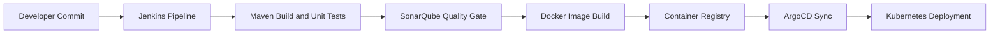

# Java DevSecOps CI/CD with Jenkins, SonarQube, Docker, ArgoCD and Kubernetes

> **Stage 1 of 12 — Career Progression Project**  
> Portfolio project by **Yugandhar Ethamukkala**.

Enterprise-style CI/CD project for a Spring Boot application using Jenkins, Maven, SonarQube quality gates, Docker image builds, Kubernetes manifests, and ArgoCD deployment flow.

## Career Progression Story

CI/CD foundation: I started by building a classic enterprise delivery pipeline for a Java Spring Boot application.

This repo is part of my 12-project DevOps portfolio path. The goal is to show steady growth from CI/CD foundations into AWS cloud, Kubernetes, GitOps, observability, DevSecOps, progressive delivery, and AI-enabled deployments.

## What This Project Demonstrates

- Demonstrates a full Jenkins CI/CD workflow for enterprise Java applications.
- Connects build, test, static analysis, Docker packaging, and Kubernetes deployment.
- Good interview story for older enterprise environments still using Jenkins.

## Tech Stack

`Java` `Spring Boot` `Maven` `Jenkins` `SonarQube` `Docker` `Kubernetes` `ArgoCD` `GitOps`

## Architecture



## Repository Structure

```text
.
├── README.md
├── REPO_UPLOAD_CHECKLIST.md
├── docs/
├── project.yaml
├── spring-boot-app/
├── spring-boot-app-manifests/
```

## Prerequisites

- Git
- Docker where containers are used
- Cloud CLI/tools only when deploying cloud resources
- `kubectl`, `kind`, `terraform`, `sam`, `maven`, `npm`, or `python` depending on the project
- Never commit real `.env` files, API keys, access keys, kubeconfigs, private keys, or tokens

## Local Run

```bash
cd spring-boot-app
mvn clean package
docker build -t spring-boot-devops:local .
docker run --rm -p 8080:8080 spring-boot-devops:local
```

## Validation Before GitHub Upload

Run these checks before pushing major changes:

```bash
mvn -q -f spring-boot-app/pom.xml test
test -f spring-boot-app/Jenkinsfile
test -f spring-boot-app-manifests/deployment.yml
```

## Deployment Overview

1. Create Jenkins credentials for Docker registry and Kubernetes access.
2. Run the Jenkins pipeline to build, test, scan, and publish the image.
3. Update the Kubernetes manifest image tag.
4. Use ArgoCD to sync the application into the cluster.

## Screenshots to Add

This project did not include ready project snapshots in the uploaded folder, so I prepared a screenshot folder for you.

Add these after you run the project:

- `docs/screenshots/architecture.png`
- `docs/screenshots/pipeline-success.png`
- `docs/screenshots/deployment-output.png`
- `docs/screenshots/monitoring-dashboard.png`
- `docs/screenshots/cleanup-proof.png`

Do not add screenshots with account IDs, IP addresses, tokens, billing pages, or private URLs.

## Cleanup / Cost Control

Run cleanup commands after testing so cloud resources do not keep charging:

```bash
kubectl delete -f spring-boot-app-manifests/ --ignore-not-found=true
docker image rm spring-boot-devops:local || true
```

## Security Notes

- Use GitHub Actions OIDC, Jenkins credentials, AWS Secrets Manager, Vault, or Kubernetes Secrets instead of hard-coded keys.
- Keep `.env` files local and commit only `.env.example` with safe placeholders.
- Review Terraform plans before apply/destroy.
- Do not publish account IDs, private IPs, public IPs from your lab, billing pages, or credential screenshots.

## How I Would Explain This in an Interview

I built this project as part of my DevOps portfolio to show hands-on experience with the tools used in real delivery environments. The focus is not only on writing code, but also on creating a repeatable workflow for build, validation, deployment, security, monitoring, and cleanup.

In a real project, I would connect this type of setup with environment-specific variables, approval gates, secrets management, monitoring dashboards, and rollback steps so teams can release safely and troubleshoot faster.

---

<p align="center">
  
</p>

<h2 align="center">🤝 Connect With Me</h2>

<p align="center">
  <em>
    Thanks for visiting this project! I’m continuously building hands-on DevOps, Cloud, Automation, and AI-enabled engineering projects to improve real-world deployment, monitoring, and infrastructure skills.
  </em>
</p>

<p align="center">
  
</p>

<p align="center">
  <a href="https://github.com/yugandhar99" target="_blank" rel="noopener noreferrer">
    
  </a>
  <a href="https://www.linkedin.com/in/yugandhar-devops" target="_blank" rel="noopener noreferrer">
    
  </a>
  <a href="https://yugandhar-portfolio-psi.vercel.app/" target="_blank" rel="noopener noreferrer">
    
  </a>
  <a href="mailto:yugandharethamukkala1999@gmail.com">
    
  </a>
</p>

<p align="center">
  
  
  
  
</p>

---

<p align="center">
  ⭐ If this project added value, feel free to star the repository and connect with me!
</p>

<p align="center">
  <strong>Built with ❤️ using modern DevOps practices</strong>
</p>

